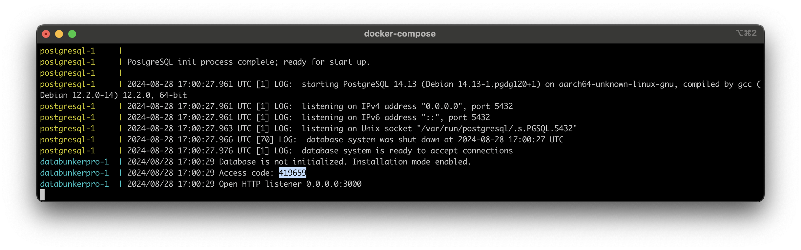
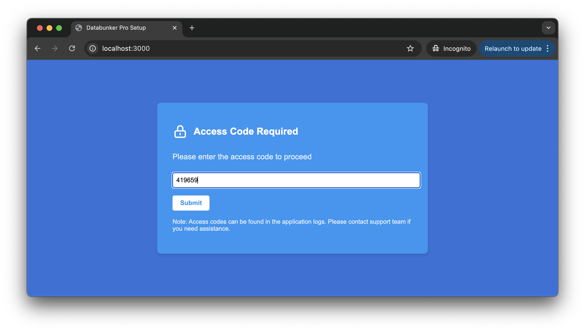
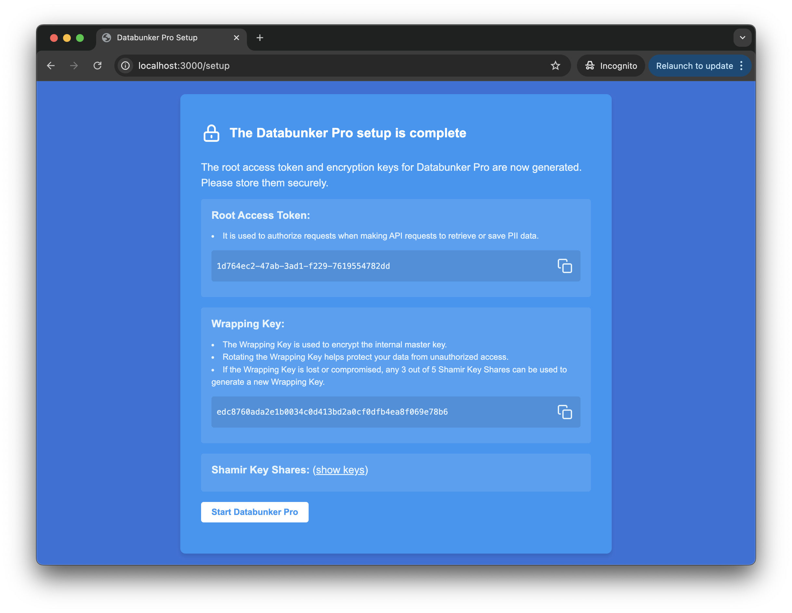

**Databunker Pro** is the professional version of Databunker, an open-source secure storage solution for sensitive records. This guide will walk you through the installation and setup process.

<a href="javascript:void(0);" onclick="request_free_trial();">&gt;&gt; Request free trial</a>

## Deployment Options
You can deploy Databunker Pro using one of the following methods:

* Docker Compose
* Kubernetes

## Prerequisites

* Docker and Docker Compose (for Docker deployment)
* Kubernetes cluster (for Kubernetes deployment)
* ``generate-env-files.sh`` script (optional, for generating initial credentials and keys)

## Installation Steps

### 1. Prepare Environment (Optional)

If you want to generate initial database access credentials, SSL keys, and a wrapping key, run the provided ``generate-env-files.sh`` script:

```
./generate-env-files.sh
```

Note: If you don't use this script, the wrapping key will be automatically generated during the Databunker Pro setup process.

### 2. Deploy Databunker Pro

**Option A: Deploy Using Docker Compose**

1. Create a ``docker-compose.yml`` file with the Databunker Pro configuration.
2. Run the following command:

```
docker-compose up -d
```

**Option B: Deploy Using Kubernetes**

1. Create a Kubernetes deployment YAML file for Databunker Pro.
2. Apply the configuration:

```
kubectl apply -f databunker-pro-deployment.yaml
```

Note: Start with one pod initially. After completing the setup, you can scale to more nodes.

### 3. Initial Setup

1. Once deployed, check the service logs to find the Access Code.




2. Open the Databunker Pro setup page in your web browser.
3. You will see the following screen:




4. Enter the Access Code found in the service logs.
5. Upon successful entry, the service will generate encryption and access keys, and create the database.
6. You will then see the completion page:



7. Make sure to securely store the Root Access Token, Wrapping Key, and Shamir Key Shares.
8. Click the **Start Databunker Pro** button to reload Databunker Pro in regular mode.


### Post-Installation

After completing the setup, you can now use the **Root Access Token** with the API to save or retrieve data.

## Security Notes

* Databunker Pro uses an internal master key to encrypt the data. This key is automatically generated and never revealed.
* The Wrapping Key is used to encrypt the internal master key, adding an extra layer of security.
* Regularly rotate the Wrapping Key to enhance security.
* In case of a lost or compromised Wrapping Key, you can use any 3 out of 5 Shamir Key Shares to generate a new one.

## Scaling (Kubernetes)
If you deployed Databunker Pro on Kubernetes, you can now scale to more nodes:

```
kubectl scale deployment databunker-pro --replicas=3
```

Adjust the number of replicas as needed for your use case.

For any additional assistance or questions, please refer to the Databunker Pro documentation or contact the support team.

## What's next?
- [Master Key Architecture](/databunker-pro-docs/master-key/)
- [Wrapping Key Rotation](/databunker-pro-docs/wrapping-key/)
- [Shamir Keys](/databunker-pro-docs/shamir-keys/)
- [Multi-tenancy](/databunker-pro-docs/tenant-api/)
- [Tokenization API](/databunker-pro-docs/tokenization/)
