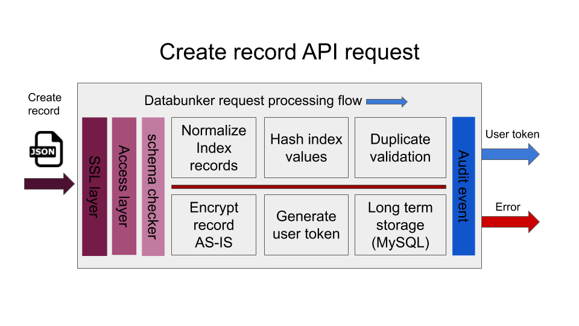

Databunker is a complex system that has many different pieces. This document will help you to understand the Databunker high-level concepts and architecture.

**Databunker** is a **vault** for personal records with a twist.

**Vault** products are well-known. For example Hashicorp Vault, or cloud-based tools like AWS Secret Manager or GCP Secret Manager. These tools store binary secret values in encrypted form. These secret values can be database passwords, user private keys, or API tokens. The **vault** knows to encrypt the secret value and store it and provide an API for easy access.

Databunker has another use-case. It can be used to secretly store the whole user record. This record can include a user name, IP address, password, credit card, blockchain keys, healthcare information, etc... Databunker expects to receive the whole user record in JSON format. Databunker stores encrypted records in the back-end database. Out of the personal record, before encryption, Databunker knows to extract the user's email address, phone number, login value if present, and builds a search index. This search index is also hashed on the database level. So, if the attacker gains access to the Databunker back-end database, everything is encrypted or hashed including the search index.

Your code must supply additional user records like first name, last name, user address when calling a Create User API call. These values should be encoded in HTML POST key/value format or JSON format. 

When a request is made to create a user record, Databunker performs the following operations:

1. Request sanity check and access token check
1. Normalize email address, phone number, login name
1. Optional strict user schema checks if schema is defined in configuration
1. Calculate secure hash values for email address, phone number, login name
1. Duplicate record validation using using hashed values of email address, phone number, login name
1. Generate a new record UUID to be used as a user token
1. Encrypt the whole user json and save it in backend database (MySQL, PostgreSQL, SQLite)
1. Return newly generated user token to the caller

After creating a new user record, Databunker returns to the caller a user token inn UUID format. That token can be saved in existing database instead of storing personal records or PII/PHI.

Databunker provides you an API to lookup user records using the **email address**, **phone number**, **login name** or a **token** received when you create a user record.

Databunker was built with privacy in mind and this is where the product really shines. It provides GDPR compliance, i.e. an audit of changes, handling for user requests like forget-me requests, user request change management, optional DPO approval, etc...

From a technical perspective, the product has many additional features, like the expiration of records, shareable record identities; additional user records, etc...

