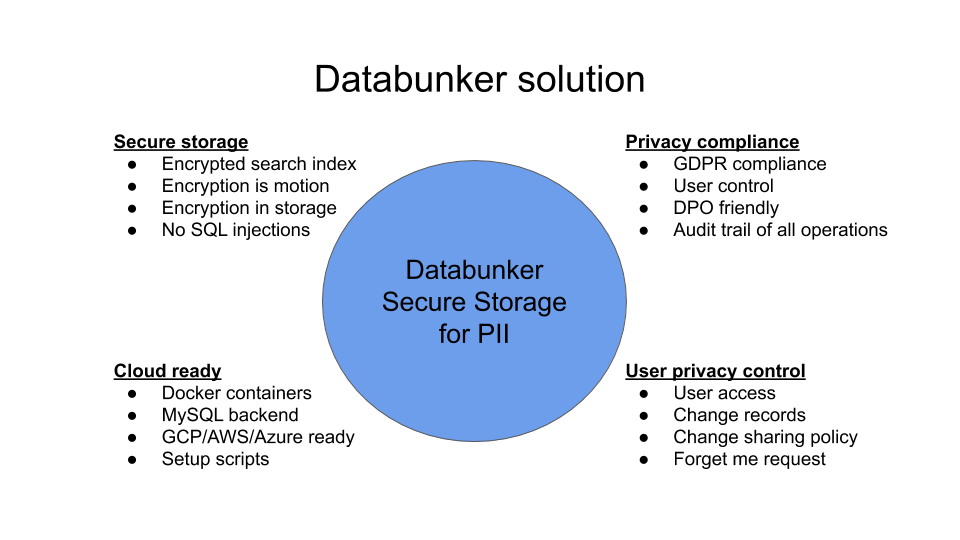

Databunker is a complex system that has many different pieces. This document will help you to understand the Databunker high-level concepts.

You can think of **Databunker** as a **vault** for personal records with a twist.

Vault products are well-known. For example Hashicorp Vault, or cloud-based like AWS Secrets Manager or GCP Secret Management tools. These tools store binary secret values. This value can be a database password or some custom structure. They encrypt the value received and store it secretly and provide an API to access this secret value.

## Request processing flow

Databunker on the contrary, in used when you need to store personal records secretly. These records can include passwords, credit cards, blockchain keys, healthcare information, etc... Databunker expects to receive a user record in JSON format or key-value format (that is also converted to JSON). Databunker stores encrypted records in the back-end database. Out of the data, before encryption, It knows to extract user email address, phone number, login value if present, and builds a search index. This search index is also hashed. So, if the attacker gains access to the Databunker back-end database, everything is encrypted including the search index.

After saving user personal data, Databunker provides you an API to lookup user records using the **email address**, **phone number**, **login name** or a **token** received when you create user records.

Databunker was built with privacy in mind and this is where the product really shines. It provides full GDPR compliance, i.e. an audit of changes, handling for user requests like forget-me requests, user request change management, optional DPO approval, etc...

From a technical perspective, the product has many additional features, like the expiration of records, shareable record identities; additional user records, etc...

