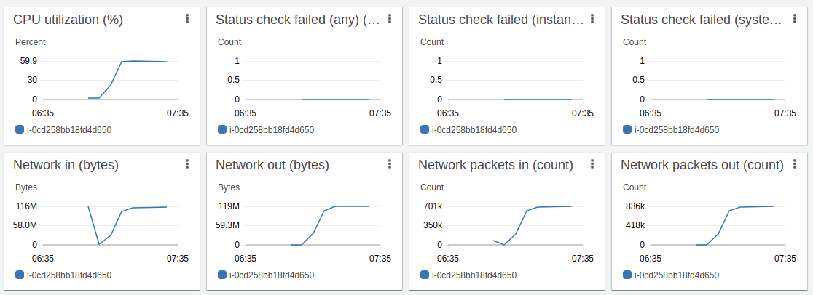
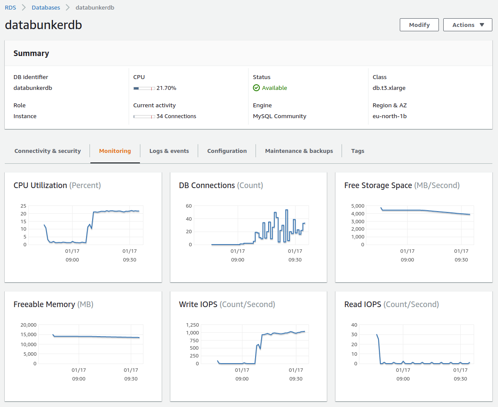

### Test 1. Storing one million PII records using AWS EKS & RDS (22.01.2022)

For the test we deployed Databunk open-source in AWS cloud using the Terraform and Helm Charts.

During the test only one EKS node was created to run a Databunker container and one virtual server to run MySQL RDS.

### Performance results when using t3.xlarge virtual servers

We used **db.t3.xlarge** for the database server and **t3.xlarge** for the Kubernetes node.

On average the system was able to sustain **347 requests per second**. It took 48 minutes to create 1 million data subject records.


### Performance results when using t3.medium virtual servers

We used **db.t3.medium** for the database server and **t3.medium** for the Kubernetes node.

On average the system was able to sustain **280 requests per second**. It took 60 minutes to create 1 million data subject records.


### EKS Node t3.xlarge utilization during the test



### MySQL RDS db.t3.xlarge utilization during the test




### How to reproduce

#### 1. Deploy AWS cloud to run the test

Use the following Terraform configuration files:

https://github.com/securitybunker/databunker/tree/master/terraform/aws


#### 2. Start a new EC2 machine that will run the stress test script

For the test, we created a special python script. This script starts 100 threads. Each thread creates 10,000 data subject records. Each thread is using **requests.Session()** python object to utilize already opened connections as Databunker supports **keep-alive** connections.

This script will create 1 million data subject records in Databunker.

```
import sys
import time
import gevent
from gevent import monkey;
monkey.patch_all(httplib=True)
import urllib3
urllib3.disable_warnings(urllib3.exceptions.InsecureRequestWarning)
import random
import logging
import requests

token = "dc50686c-02aa-3280-1265-8fb55edbeb9b"
url = 'https://a09e31b9f05ad434aad32a55d000decd-1066274597.eu-north-1.elb.amazonaws.com:8443'

logger = logging.getLogger("stresstest")
logger.setLevel(logging.DEBUG)
formatter = logging.Formatter("%(asctime)s: %(levelname)s: %(message)s")
ch = logging.StreamHandler()
ch.setLevel(logging.DEBUG)
ch.setFormatter(formatter)
logger.addHandler(ch)

def generate(start):
  s = requests.Session()
  for n in range(start*10000, (start+1)*10000):
    if n % 1000 == 0:
     logger.warning("create: "+str(n))
    userobj = {'somekey': 'somevalue', 'email':str(n)+'@gmail.com'}
    x = s.post(url+'/v1/user', data = userobj, headers={'X-Bunker-Token':token}, verify=False)
  logger.warning("finish " + str(start*10000) + " " + str((start+1)*10000))
  return start

threads = [gevent.spawn(generate, i) for i in range(1, 100)]
gevent.joinall(threads)
logger.warning("done")
```

&nbsp;

### Test 2. All-in-one test using DigitalOcean droplet (11.04.2021)


For the test, we are using one DagitalOcean droplet to run a test scrript, backend database, databunker itself and a front-end application.

This droplet comes with the following configuration: **1 GB RAM** / **1 Intel CPU** / **25 GB NVMe SSD**.

We run the system test for Databunker - meaning we test the whole stack - both Node.js, Databunker, and backend database (MySQL).  For the test, we created a simple Node.js app server. This app server supports a single operation that prints user email returned from Databunker.

On each API request, Databunker goes to MySQL and loads user record (```SELECT``` MySQL command), decrypts the record, creates an audit trail (```INSERT``` MySQL command) and returns the user object to the caller. To make sure we are getting the best results, we updated node.js libraries to reuse open HTTP/HTTPS sockets.

Our test includes the following components:

1. Databunker running locally as the docker container.
2. MySQL server running locally as a docker container.
3. Node.js app server running locally.
4. Shell ```ab``` command running locally is used to test the results.

Final results: **Node.js app server can sustain 155 requests per second when loading data from Databunker**.

## Node.js app server code

```
const { v4: uuidv4 } = require('uuid');
const app = require('express')();
const DatabunkerStore = require('@databunker/store');

const port = 3200;
const host = '0.0.0.0';
const DataBunkerConf = {
  url: 'http://localhost:3000',
  token: 'DEMO'
};
const databunker = new DatabunkerStore(DataBunkerConf);

app.get('/', async (req, res) => {
  const user = await databunker.users.get("phone", "4444");
  const data = user.data;
  res.send("user: "+data["email"]+"\n");
  res.end();
})

app.listen(port, host, () => {
  console.log(`Example app listening at http://${host}:${port}`)
})
```

## Shell ab command

```ab -n 1000 -c 10 http://0.0.0.0:3200/```

#### Result:

```
ab -n 1000 -c 10 http://0.0.0.0:3200/
This is ApacheBench, Version 2.3 <$Revision: 1843412 $>
Copyright 1996 Adam Twiss, Zeus Technology Ltd, http://www.zeustech.net/
Licensed to The Apache Software Foundation, http://www.apache.org/

Benchmarking 0.0.0.0 (be patient)
Completed 100 requests
Completed 200 requests
Completed 300 requests
Completed 400 requests
Completed 500 requests
Completed 600 requests
Completed 700 requests
Completed 800 requests
Completed 900 requests
Completed 1000 requests
Finished 1000 requests


Server Software:
Server Hostname:        0.0.0.0
Server Port:            3200

Document Path:          /
Document Length:        34 bytes

Concurrency Level:      10
Time taken for tests:   6.416 seconds
Complete requests:      1000
Failed requests:        0
Total transferred:      234000 bytes
HTML transferred:       34000 bytes
Requests per second:    155.86 [#/sec] (mean)
Time per request:       64.162 [ms] (mean)
Time per request:       6.416 [ms] (mean, across all concurrent requests)
Transfer rate:          35.62 [Kbytes/sec] received

Connection Times (ms)
              min  mean[+/-sd] median   max
Connect:        0    0   0.1      0       1
Processing:    11   64  18.0     61     163
Waiting:        7   63  17.1     60     154
Total:         12   64  18.0     61     163

Percentage of the requests served within a certain time (ms)
  50%     61
  66%     66
  75%     72
  80%     76
  90%     85
  95%     95
  98%    113
  99%    128
 100%    163 (longest request)
```
