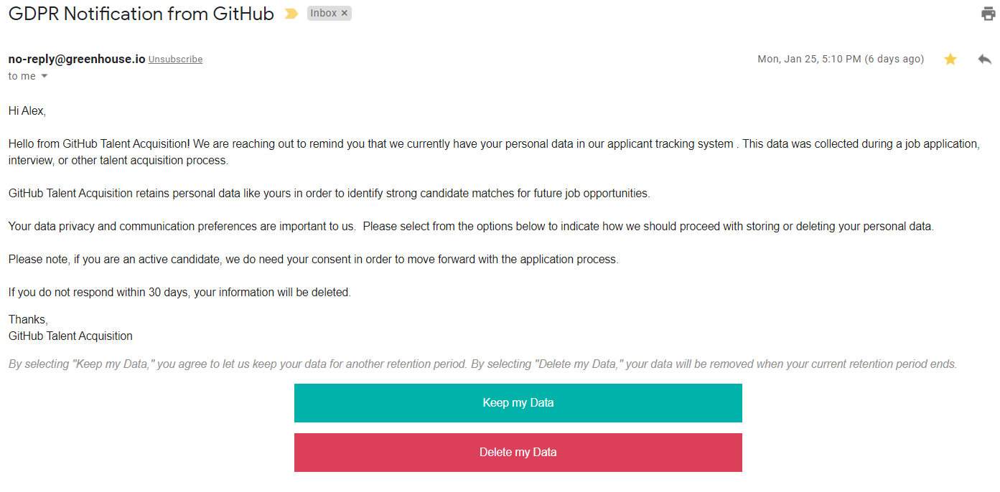

In cybersecurity, we have the principle of **least privilege**. It means your user or application process must have minimal privileges to do its job.

In privacy, we have a similar principle. It is called **data minimization**. You need to keep customer data at a minimum only sufficient to provide a service.

In this article, we’ll be taking an in-depth look at **data minimization** and why it is important.

Then I will talk about an open-source product I am developing called **Databunker** and how it can help. **Databunker** is a Swiss army knife tool for storing personal records or PII.


## GDPR Data Minimization Definition

If you look in the official [GDPR Article 5](https://gdpr-info.eu/art-5-gdpr/) you will find the following. ***Personal data shall be (c) adequate, relevant and limited to what is necessary in relation to the purposes for which they are processed (DATA MINIMIZATION) and (e) kept in a form which permits identification of data subjects for no longer than is necessary for the purposes for which the personal data are processed.***

## CPRA Data Minimization Definition

Data minimization is not mandated by the CCPA. But **California Privacy Rights Act of 2020 (CPRA)** approved on November 3, 2020, has **data minimization**.

Similar to HIPAA’s minimum necessary rule and the GDPR’s data minimization principle, the CPRA codifies **data minimization principles**: The collection, use, retention, and sharing of personal information must be ***"reasonably necessary and proportionate to achieve the purposes for which the personal information was collected or processed"***.  The new law also requires notice of retention periods, and those retention periods must be ***"no longer than reasonably necessary"*** for each disclosed purpose.

## So, why data minimization is so important?

One of the results of the Data Minimization definition is that companies must remove personal records for expired trial users or users who left the company’s service.

Take a look at the next image:



You can see an email received by a job candidate from GitHub. GitHub tells the candidate that his personal data will be removed in 30 days. Or, the candidate can leave his details by pressing "Keep my Data".

To comply with privacy regulations, you must not wait for your customer's **forget-me request**. ``You need to start the removal of personal data for these expired customers by yourself.``

## Introduction to Databunker

But first, let me give you a brief about what Databunker is and how it works since we'll be discussing it in some of these methods below.


**Databunker** is a secure vault for customer records that works with any Web and mobile app. It is a backend application service. This product is a combination of several software concepts merged together. It provides secure PII storage and privacy by design out of the box:

1. A Personal Identifiable Information (PII) storage and vault
1. Secure session storage for web applications
1. Privacy portal for customers
1. Application backend server
1. DPO management tool
1. Tokenization service
1. Secret sauce


## How does Databunker can help with Data Minimization?

### 1. Consolidate all customer personal data from different databases and store it only in Databunker.

By storing customer personal data in the Databunker, you basically minimize the attack outcome from your existing database, thus minimizing the business risk factors.

Suppose, the bad actor finds an **SQL injection** in your web app database. The **bad actor** might be able to dump your web application database and get access to customers' personal data. This data will not be personal as this information is stored outside of your existing database (in Databunker).

### 2. Semi-automatic personal data removal

Databunker has a built-in API to expire user records.

1. Trigger user expiration flow. You will need to call it from your backend.
```
curl -H "X-Bunker-Token: DEMO" -X POST https://databunker-server/v1/exp/start/email/user@email.com \
  -d '{"expiration":"1"}'
```
This call will trigger user expiration flow. This command returns the user's expiration identity (**exptoken**).
```
 {"status":"ok","exptoken":"fc9c9f10-2d10-e986-29d2-4fee19d142b1"}
```

2. Now you can send out to your user an email with the following links:

Retain data link: ``https://databunker-server/v1/exp/retail/{exptoken}``

Remove data link: ``https://databunker-server/v1/exp/delete/{exptoken}``

The links will work now in the browser without additional authentication.

3. Cancel user account expiration. This request required an admin or user token.

```
curl -H "X-Bunker-Token: DEMO" -X DEMO https://databunker-server/v1/exp/cancel/email/user@email.com
```

4. Get user expiration status. This request requires an admin or user token.

```
curl -H "X-Bunker-Token: DEMO" https://databunker-server/v1/exp/status/email/user@email.com
{"status":"ok","exptime":1631568237,"expstatus":"wait","exptoken":"487964c0-8c86-bb99-ce8a-e7d6fe9151d9"}
```
