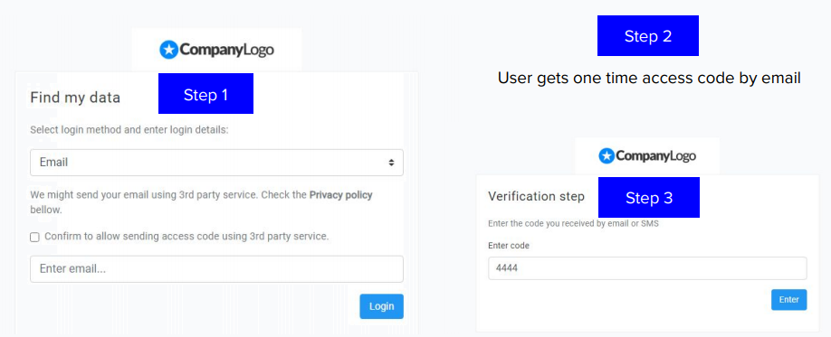

{}
Click on the **Slides** button above to view the built-in slides feature.
{}

Databunker project was born to give a simple solution for any organization to become **privacy by design compliant** and **GDPR compliant** and that is where the product really shines.

It’s architecture design ideas crystallize is a simple solution that provides organizations an easy to use API to store and retrieve personal customer records. The product itself takes to care for most of the GDPR requirements.

For example, upon user record creation request, Databunker knows to extract email, phone, login name, and build an encrypted search index. Using this information, the service can grant the user temporary access to view, and initiate personal information change or manage privacy consents.

Databunker product gives your customers passwordless access to the Databunker privacy portal. We send your customer a one-time login code by SMS or email to give them access to their account at Databunker.

### Databunker can help you with the following GDPR requirements:

* **Access**: your customers can log in to his Databunker account and view personal data.
* **Withdraw**: your customers can withdraw consents given previously.
* **Update**: your customers can change their personal data saved in Databunker.
* **Delete**: your customers can perform a "forget-me" request inside Databunker.
* **Restrict**: your customers can specify what operations they allow with their personal profiles.
